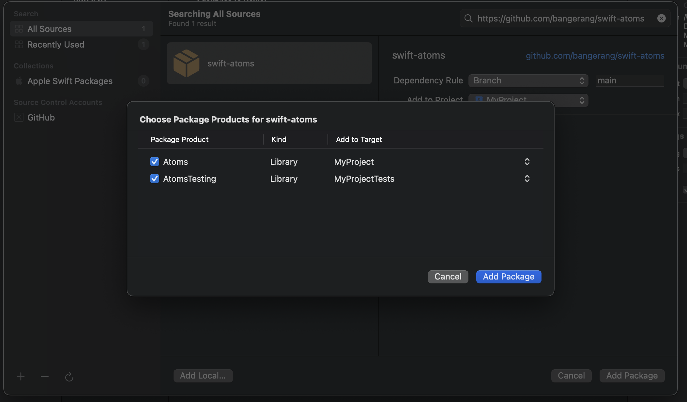

# Atoms

**Atoms** is a powerful and flexible atomic state management library for Swift, designed to create compact, independent global state components with seamless adaptability and composition.

```swift
// Create a text atom
let textAtom = Atom("")

// Create a derived atom that depends on textAtom.
// Atoms automatically update their state when any of their dependencies change.
let extractedNumbersAtom = DerivedAtom {
    @UseAtomValue(textAtom) var text
    return text.filter {
        $0.isNumber
    }
}

struct ContentView: View {
    // Provide write access to the textAtom
    @UseAtom(textAtom) var text
    // Provide read-only access to the extractedNumbersAtom
    @UseAtomValue(extractedNumbersAtom) var numbers
    
    var body: some View {
        VStack {
            TextField("", text: $text)
            Text("Extracted numbers: \(numbers)")
        }
    }
}
```

## Motivation

SwiftUI provides great built-in support for handling state, but its object-oriented approach can make code splitting challenging. That's where **Atoms** can help.
 
**Atoms** provide a more granular level of state management, allowing you to focus on what you need without worrying about where to put things. By avoiding large observable objects with many published properties, **Atoms** help you steer clear of performance bottlenecks due to rendering, while maintaining a single source of truth in your app's architecture.

## Overview

**Atoms** comes with 9 different atom types that should cover most of your needs, such as dealing with asyncronousy.

```swift
let searchTextAtom = Atom("")

let apiAtom = Atom(...)

// Define a dogsAtom for fetching dogs based on the search text
let dogsAtom = AsyncAtom<[Dog]> {
    @UseAtomValue(searchTextAtom, debounce: 0.3) var searchText
    @UseAtomValue(apiAtom) var api
    return try await api.searchDogs(searchText)
}

struct SearchDogsView: View {
    @UseAtom(searchTextAtom) var searchText
    @UseAtomValue(dogsAtom) var dogsState
    
    var body: some View {
        NavigationStack {
            List {
                switch dogsState {
                case .loading:
                    ProgressView()
                case .success(let dogs):
                    ForEach(dogs) {
                        Text($0.name)
                    }
                case .failure(let error):
                    Text(error.localizedDescription)
                    Button("Try again") {
                        dogsAtom.reload()
                    }
                }
            }
            .searchable(text: $searchText)
        }
    }
}
```

## List of atoms

All atoms that accept a closure as their initial argument will update automatically when their dependencies change.

- [**Atom**](https://bangerang.github.io/swift-atoms/documentation/atoms/atom): Represents a state for a given value of type `T`.
- [**DerivedAtom**](https://bangerang.github.io/swift-atoms/documentation/atoms/derivedatom): A read-only state derived from other atom states.
- [**AsyncAtom**](https://bangerang.github.io/swift-atoms/documentation/atoms/asyncatom): Manages asynchronous operations that produce a value of type `T` or throw an error, with states represented as `AsyncState<T>`.
- [**AsyncSequenceAtom**](https://bangerang.github.io/swift-atoms/documentation/atoms/asyncsequenceatom): Manages the state of an asynchronous sequence producing values of type `T` or throwing an error, with states represented as `AsyncState<T>`.
- [**GetSetAtom**](https://bangerang.github.io/swift-atoms/documentation/atoms/getsetatom): Custom getter and setter for values of type `T`.
- [**ObservableObjectAtom**](https://bangerang.github.io/swift-atoms/documentation/atoms/observableobjectatom): Represents a readable state for a given value of type `T` that conforms to `ObservableObject`.
- [**PublisherAtom**](https://bangerang.github.io/swift-atoms/documentation/atoms/publisheratom): Represents a readable state from a `Publisher`, with states represented as `AsyncState<T>`.
- [**PublishedAtom**](https://bangerang.github.io/swift-atoms/documentation/atoms/publishedatom): Represents a readable state from a `Published` property of type `T`.
- [**WillSetAtom**](https://bangerang.github.io/swift-atoms/documentation/atoms/willsetatom): Stores values of type `T` and performs custom logic before updating the stored value.

## Property Wrappers

- [**UseAtom**](https://bangerang.github.io/swift-atoms/documentation/atoms/useatom): Provides read and write access to the atom's value, and it's reactive to changes.
- [**UseAtomValue**](https://bangerang.github.io/swift-atoms/documentation/atoms/useatomvalue): Provides read-only access to the atom's value, and it's reactive to changes.
- [**CaptureAtom**](https://bangerang.github.io/swift-atoms/documentation/atoms/captureatom): Captures the atom's value and provides read and write access without being reactive to changes.
- [**CaptureAtomValue**](https://bangerang.github.io/swift-atoms/documentation/atoms/captureatomvalue): Captures the atom's value as a constant and provides read-only access without being reactive to changes.
- [**CaptureAtomPublisher**](https://bangerang.github.io/swift-atoms/documentation/atoms/captureatompublisher):  Provides an `AnyPublisher<T, Never>` that emits the current value of the atom and any subsequent updates.

## Dependency injection

**Atoms** supports testing and overriding values through dependency injection.

```swift
struct SearchDogsView_Previews: PreviewProvider {
    static var previews: some View {
        SearchDogsView()
            .inject(dogsAtom) {
                return .success([
                    .init(name: "Pluto"),
                    .init(name: "Lassie")
                ])
            }
    }
}
```

For testing, one can use the `TestStore`.

```swift
@MainActor
func testDogsSuccess() async throws {
    let mock: [Dog] = [.init(name: "Pluto"), .init(name: "Lassie")]
    try await TestStore { store in
        store.inject(apiAtom) {
            .init(searchDogs: { _ in
                return mock
            })
        }
        @CaptureAtomValue(dogsAtom) var dogsState: AsyncState<[Dog]>
        @CaptureAtom(searchTextAtom) var searchText: String
        searchText = "Foo"
        try await expectEqual(dogsState, .success(mock))
    }
}
```

## Adaptive Memory Management

By default, atom values are stored in memory only while they are actively being used. However, it is still possible to keep certain values alive if needed by passing `keepAlive: true` when creating an atom.

## Use with UIKit

**Atoms** can also be used with UIKit in addition to SwiftUI. You can use `@CaptureAtomPublisher` to subscribe to any atom value changes.

```swift
class ViewController: UIViewController {
    @CaptureAtomPublisher(searchTextAtom) var searchTextPublisher
    
    private let label = UILabel()
    private var cancellable: AnyCancellable?

    override func viewDidLoad() {
        super.viewDidLoad()
        view.addSubview(label)
        cancellable = searchTextPublisher
            .sink { [weak self] text in
                self?.label.text = text
            }
    }
}
```

## Namespacing

If the global namespace is not your thing, you can always create static let properties for scoping.

```swift
enum MyAtoms {
    static let atom = Atom("")
    static let derived = DerivedAtom {
        @UseAtomValue(atom) var someValue
        return someValue.filter {
            $0.isNumber
        }
    }
}
```


## Debugging

Atoms provides built-in debugging support to help you track state changes. Use the `enableAtomLogging` method on a `View`.

```swift
Text("Hello, World!")
    .enableAtomLogging()
```
Or directly through the `AtomStore`.
```swift
AtomStore.shared.enableAtomLogging(debugScope: .include([counterAtom]))
```

## Known Issues

Using property wrappers inline without a following keyword will lead to a compiler error. Hopefully this will be fixed in future Swift versions. The workaround for now is to either add a semicolon or explicitlly state the type.

```swift
let someAtom = DerivedAtom {
    @UseAtomValue(someOtherAtom) var value: String
    print(value)
    return "Hello " + value
}
```

## Examples
- [Todo App](https://github.com/bangerang/swift-atoms/tree/main/Examples/TodoExample)
- [Simple signup](https://github.com/bangerang/swift-atoms/tree/main/Examples/SignupExample)
- [Search and favorite cocktails](https://github.com/bangerang/swift-atoms/tree/main/Examples/CocktailExample)

## Documentation
Can be found [here](https://bangerang.github.io/swift-atoms/documentation/atoms/)

## Installation

### Swift Package Manager

1. Open your project in Xcode.
2. Go to **File > Add Packages...**.
3. In the search bar, enter the URL of the Atoms repository: `https://github.com/bangerang/swift-atoms.git`.
4. Click **Add Package**.
5. Choose the appropriate package options and click **Add Package** again to confirm.

### Testing installation

To make writing unit tests for **Atoms** even easier, the library comes bundled with [AsyncExpectations](https://github.com/bangerang/swift-async-expectations), which is exported through the `AtomsTesting` library. To use `AtomsTesting` in your test target, make sure you add `AtomsTesting` to your test target.



While it's recommended to use `AtomsTesting` for a more convenient testing experience with **Atoms**, it is not strictly required. You can still write unit tests for Atoms using XCTExpectations.
```swift
@MainActor
func testExample() async throws {
    let expectation = expectation(description: #function)
    await TestStore { store in
        store.inject(textAtom) {
            "Foo"
        }
        
        textAtom.onUpdate { newValue in
            if newValue == "Foo" {
                expectation.fulfill()
            }
        }
        @CaptureAtomValue(textAtom) var text: String
    }
    wait(for: [expectation], timeout: 1)
}
```
